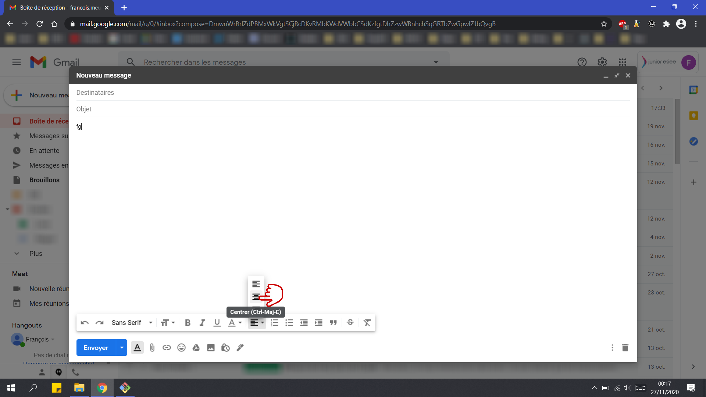
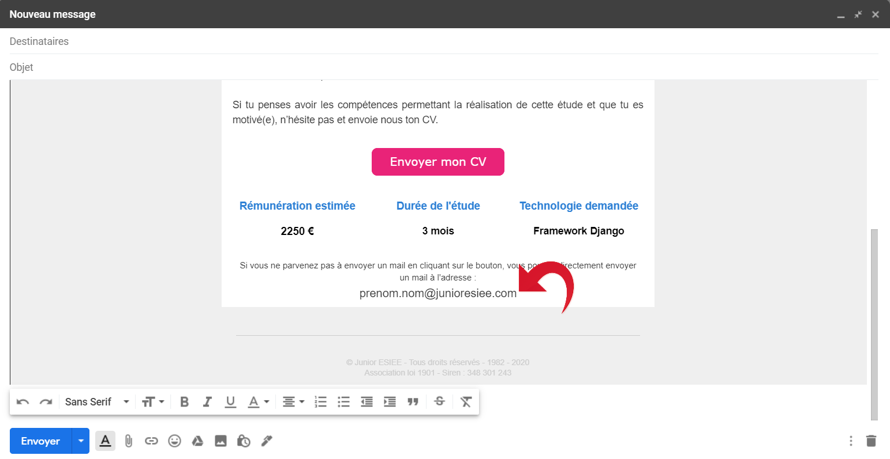

# Template mail Junior ESIEE

## Introduction

Ce nouveau template (novembre 2020) de mail est destiné aux **mails diffusion générale** de la Junior, concernant les **recherches de réalisateurs** pour les études. 
Ce mail doit être rédigé par le chef de projet de l’étude concernée ou bien par le RBU (Responsable Business Unit). 
Voici un tutoriel qui explique comment intégrer le template au mail (avec Gmail en l’occurrence). 
 
Dans un premier temps, il faut **télécharger le fichier .html** du template et suivre les différentes étapes : 
 
Clic droit sur le fichier → ‘ouvrir avec’ → ‘google chrome’ 

 &nbsp;         
    

N.B. Tout autre navigateur fonctionnera, vous pouvez aussi l’ouvrir avec un éditeur de code. 
 
Une fois le template affiché, clic droit sur la page → ‘afficher le code source de la 'page'

 &nbsp;         
    

 
Un nouvel onglet s’ouvre, il faut sélectionner tout le code (Ctrl + A) puis copier.

 &nbsp;         
    

N.B. Si vous avez ouvert le fichier avec un éditeur de code, il vous suffit de copier l’intégralité du code, sans avoir à passer par un navigateur pour cette étape. 
 
Rendez-vous ensuite dans **Gmail** sur votre adresse @junioresiee.com puis cliquez sur **nouveau message**

 &nbsp;         
    

 
La fenêtre du nouveau mail s’affiche en bas à droite, il est **impératif de l’agrandir**.
 
 &nbsp;         
    

 
Ensuite, écrivez 2-3 lettres (peu importe ce que vous écrivez) et **centrez le texte**.
 
 &nbsp;         
    

Sélectionnez le texte puis clic droit → ‘inspecter’

 &nbsp;         
    

 
La fenêtre d’inspection du code HTML de la page s’ouvre sur votre droite avec la partie du code correspondant à ce que vous avez écrit **déjà sélectionnée**. 
Faites : clic droit → ‘Edit as HTML’

 &nbsp;         
    

 
**Sélectionnez tout** puis **collez** (vous collez donc le code HTML du template).
 
 &nbsp;         
    

 
Cliquez n’importe où dans la fenêtre d’inspection, comme sur l’exemple ci-dessous. Ce afin que **le mail s’actualise**.
 
 &nbsp;         
    

 
Vous pouvez maintenant **éditer** le mail, en changeant ce qui est écrit dans le template. Vous pouvez changer la couleur du texte, mettre en gras, etc. 

 &nbsp;         
    

 
Ensuite, n’oubliez pas de **changer** en bas du mail **l’adresse mail à contacter** par celle du chef de projet en charge de la potentielle étude.
 
 &nbsp;         
    

 
Il est possible que les 3 colonnes récapitulant les informations principales ne correspondent pas à ce que vous avez pour votre étude (on ne connait pas toujours la rémunération estimée ni la durée de l’étude) mais vous pouvez les changer, voire les supprimer. C’est un plus pour que l’on retienne les principales caractéristiques de l’étude. 
Il ne vous reste plus qu’à **relire** et à **envoyer** le mail.

## À propos du template
 
Pour utiliser le template il faut **télécharger** et **utiliser uniquement** le fichier .html intitulé : **‘index_non_local.html’** 
 
En effet, dans ce fichier les images sont stockées sur des serveurs distants (serveurs Stripo), les logos des réseaux sociaux s’afficheront bien. 
 
Si vous utilisez l’autre fichier HTML, étant donné que les logos sont stockés dans le fichier ‘image’ du dépôt GitHub, il est possible qu’elles ne s’affichent pas dans le mail. 
 
L’auteur de ce template est : François Meunier (DSI 2020-2021 et chef de projet Junior ESIEE). 

 
 
 
 
 
 
 
 